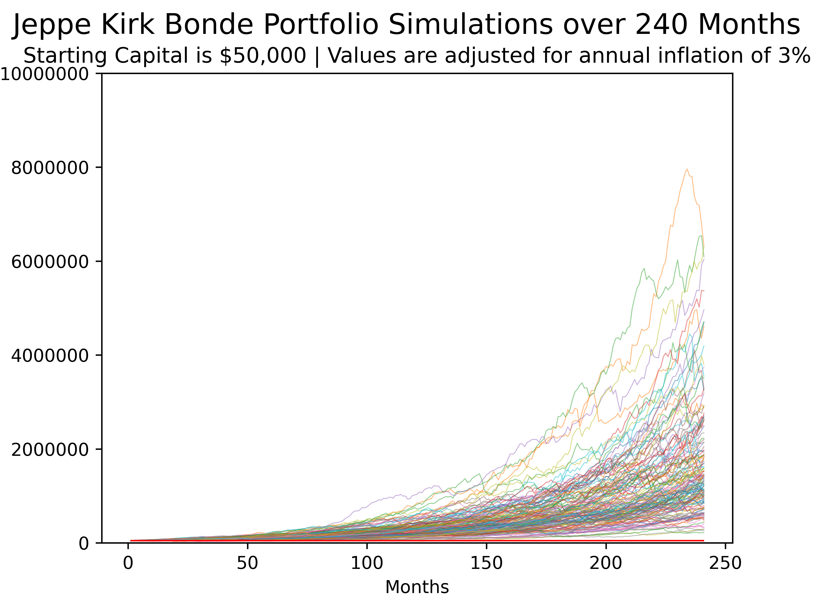

# Trader Performance Simulation under Market Uncertainty

This project simulates the long-term performance of popular traders in uncertain market conditions, inspired by copytrading platforms like eToro. By using historical market data and advanced statistical modeling, the project predicts the outcomes of a trader’s portfolio over a 20-year horizon. It evaluates the impact of market conditions and the relationship between market performance and individual trader performance.

## Table of Contents
- [Motivation](#motivation)
- [Features](#features)
- [Data Sources](#data-sources)
- [Analysis Overview](#analysis-overview)
- [Installation](#installation)
- [Usage](#usage)
- [Results](#results)
- [License](#license)

## Motivation
The emergence of copytrading has made wealth management more transparent and accessible. However, the limited historical data and the predominance of bull markets in recent years make it difficult to evaluate trader performance across diverse market conditions. This project addresses this gap by:
- Modeling the uncertainty in the relationship between market and trader performance.
- Simulating potential future market conditions to assess trader reliability and performance consistency.

## Features
- **Pairs Bootstrapping**: Generates multiple regression models to capture the uncertainty in trader performance relative to market trends.
- **Monte Carlo Simulations**: Simulates 20-year market conditions using historical S&P 500 data while maintaining serial correlation (volatility clustering).
- **Performance Metrics**:
  - Median, maximum, and minimum annual returns.
  - Inflation-adjusted portfolio values for each simulation.
  - Probability of achieving millionaire status given initial capital.
- **Visualization**: Graphs showing simulated portfolio growth adjusted for inflation over time.

## Data Sources
- **Trader Performance**: Monthly returns data for 20 popular traders.
- **Market Data**: S&P 500 monthly returns since 1970, sourced via Yahoo Finance.

## Analysis Overview
1. **Data Preparation**:
   - Scraped, cleaned, and aligned trader and market data.
   - Converted returns to log-scale for statistical modeling.
2. **Modeling**:
   - Used polynomial regression to model the relationship between trader and market performance.
   - Applied pairs bootstrapping to generate multiple regression fits, accounting for data uncertainty.
3. **Simulation**:
   - Performed Monte Carlo simulations of market conditions and trader performance over 240 months.
   - Assessed the impact of inflation and portfolio growth potential.
4. **Visualization**:
   - Generated plots of portfolio value progression over time for multiple simulated runs.

## Installation
1. Clone the repository:
   ```bash
   git clone https://github.com/yourusername/trader-performance-simulation.git
   cd trader-performance-simulation
   ```

## Usage
1. Prepare the data by running:
   ```python
   python src/scraping_etoro.py
   ```
2. Run the simulation and save results:
   ```python
   python bootstrap_polyfitting.py
   ```
3. View the results and visualizations:
   - Median, maximum, and minimum annual returns.
   - Inflation-adjusted portfolio graphs saved in the `output` directory.

## Results
The simulation provides a range of potential outcomes for each trader:
- Median, best-case, and worst-case portfolio values adjusted for inflation.
- Insights into the probability of achieving millionaire status within 20 years.

Sample visualization:



## License
This project is licensed under the [MIT License](LICENSE).
